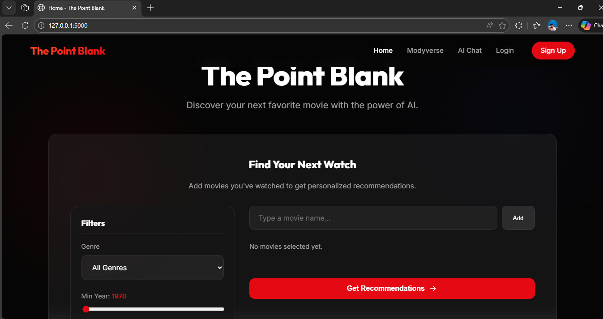
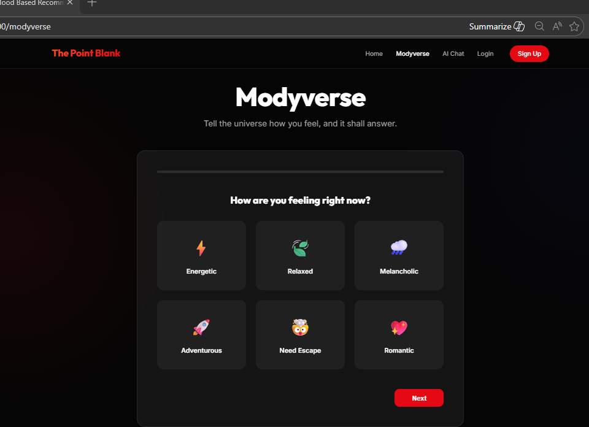
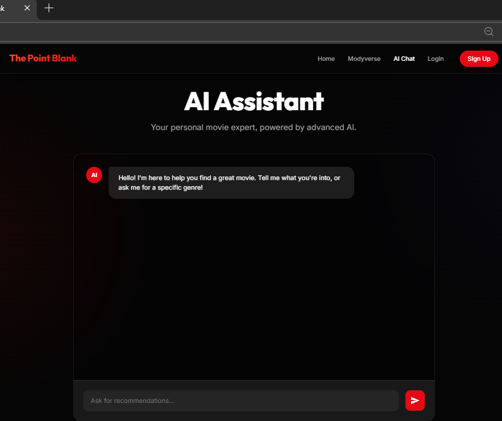

# Movie Maverick - Advanced Movies Recommendation Platform 🎬

A comprehensive, enterprise-grade movie recommendation system with AI-powered suggestions, social features, and advanced analytics. Built with Flask, PostgreSQL, Redis, and modern ML techniques.



## ✨ Features

### 🎯 Core Functionality
- **Hybrid Recommendation Engine** - Combines collaborative filtering, content-based filtering, and popularity-based recommendations
- **AI-Powered Chat Assistant** - Natural language movie discovery powered by Google Gemini
- **Mood-Based Recommendations** - "Modyverse" feature for mood-driven movie suggestions
- **Advanced Search** - Multi-criteria search with filters for genre, year, rating, actors, and directors
- **TMDB Integration** - Real-time movie data, posters, and metadata

### 👥 Social Features
- **User Profiles** - Customizable profiles with avatars and bios
- **Follow System** - Follow other users and see their activity
- **Activity Feed** - Personalized feed showing what your friends are watching
- **Review System** - Rate and review movies with rich text support
- **Social Interactions** - Like and comment on reviews
- **Custom Lists** - Create and share curated movie lists

### 🔔 Notifications
- **In-App Notifications** - Real-time notifications for follows, likes, and comments
- **Email Notifications** - Optional email alerts (configurable)
- **Achievement Badges** - Unlock badges for various milestones
- **Notification Preferences** - Granular control over notification types

### 📊 Analytics & Insights
- **Viewing History** - Track movies you've viewed
- **Search History** - Save and revisit past searches
- **Genre Preferences** - AI-analyzed genre preferences
- **User Statistics** - Comprehensive stats on your movie journey

### 🔒 Security & Performance
- **Rate Limiting** - API protection against abuse
- **Input Validation** - Comprehensive validation with Marshmallow
- **XSS Prevention** - HTML sanitization for user content
- **CSRF Protection** - Secure form submissions
- **Redis Caching** - Fast response times with intelligent caching
- **Database Optimization** - Indexed queries and connection pooling

### 👨‍💼 Admin Features
- **Content Moderation** - Review and manage reported content
- **User Management** - Admin and moderator roles
- **Featured Content** - Highlight movies and lists
- **System Monitoring** - Health checks and logging

## 🚀 Quick Start

### Prerequisites
- Docker and Docker Compose
- Python 3.11+ (for local development)
- TMDB API Key ([Get one here](https://www.themoviedb.org/settings/api))
- Google Gemini API Key ([Get one here](https://makersuite.google.com/app/apikey))

### Production Deployment with Docker

1. **Clone the repository**
   ```bash
   git clone https://github.com/yourusername/Movies_recomendation.git
   cd Movies_recomendation
   ```

2. **Configure environment variables**
   ```bash
   cp .env.example .env
   # Edit .env with your configuration
   ```

   Required variables:
   ```env
   SECRET_KEY=your-secret-key-here
   POSTGRES_PASSWORD=your-secure-password
   TMDB_API_KEY=your-tmdb-api-key
   GEMINI_API_KEY=your-gemini-api-key
   ```

3. **Deploy with Docker Compose**
   ```bash
   chmod +x scripts/*.sh
   ./scripts/deploy.sh production
   ```

4. **Initialize the database**
   ```bash
   ./scripts/init_db.sh
   ```

5. **Access the application**
   - Application: http://localhost:5000
   - Admin panel: http://localhost:5000/admin (create admin user first)

### Local Development

1. **Create virtual environment**
   ```bash
   python -m venv .venv
   source .venv/bin/activate  # On Windows: .venv\Scripts\activate
   ```

2. **Install dependencies**
   ```bash
   pip install -r requirements.txt
   ```

3. **Set up environment**
   ```bash
   cp .env.example .env
   # Edit .env with development settings
   ```

4. **Run the application**
   ```bash
   python app.py
   ```

## 📁 Project Structure

```
Movies_recomendation/
├── app.py                      # Main Flask application
├── config.py                   # Configuration management
├── Dockerfile                  # Production Docker image
├── docker-compose.yml          # Multi-container orchestration
├── requirements.txt            # Python dependencies
│
├── model/                      # Database models and ML
│   ├── models.py              # SQLAlchemy models
│   ├── recommenders.py        # Recommendation engines
│   └── ai_recommender.py      # Gemini AI integration
│
├── routes/                     # API routes
│   ├── social.py              # Social features
│   └── notifications.py       # Notification system
│
├── middleware/                 # Security and validation
│   ├── validators.py          # Input validation schemas
│   └── security.py            # Security utilities
│
├── utils/                      # Utility modules
│   ├── cache.py               # Redis caching
│   ├── notification_service.py # Notification management
│   ├── tmdb_client.py         # TMDB API client
│   ├── achievements.py        # Achievement system
│   └── streaming_availability.py
│
├── templates/                  # HTML templates
│   ├── about.html             # Landing page
│   ├── index.html             # Explore page
│   ├── profile.html           # User profile
│   ├── movie_details.html     # Movie details
│   └── ...
│
├── static/                     # Static assets
│   ├── style.css              # Stylesheets
│   └── js/                    # JavaScript files
│
├── nginx/                      # Nginx configuration
│   └── nginx.conf             # Reverse proxy config
│
├── scripts/                    # Deployment scripts
│   ├── deploy.sh              # Deployment automation
│   ├── backup.sh              # Database backup
│   └── init_db.sh             # Database initialization
│
└── data/                       # Movie datasets
    ├── movies_enriched.csv
    └── ratings.csv
```

## 🔧 Configuration

### Environment Variables

| Variable | Description | Required | Default |
|----------|-------------|----------|---------|
| `FLASK_ENV` | Environment (development/production) | No | development |
| `SECRET_KEY` | Flask secret key | Yes | - |
| `DATABASE_URL` | PostgreSQL connection string | Yes | - |
| `REDIS_URL` | Redis connection string | Yes | redis://localhost:6379/0 |
| `TMDB_API_KEY` | TMDB API key | Yes | - |
| `GEMINI_API_KEY` | Google Gemini API key | Yes | - |
| `SENTRY_DSN` | Sentry error tracking DSN | No | - |
| `MAIL_SERVER` | SMTP server for emails | No | smtp.gmail.com |
| `MAIL_USERNAME` | Email username | No | - |
| `MAIL_PASSWORD` | Email password | No | - |

### Database Configuration

The application uses PostgreSQL in production and SQLite in development. Database migrations are managed with Flask-Migrate.

```bash
# Create a new migration
docker-compose exec web flask db migrate -m "Description"

# Apply migrations
docker-compose exec web flask db upgrade

# Rollback migration
docker-compose exec web flask db downgrade
```

## 🧪 Testing

```bash
# Run all tests
pytest

# Run with coverage
pytest --cov=. --cov-report=html

# Run specific test file
pytest tests/test_recommendations.py

# Load testing
locust -f tests/test_load.py
```

## 📊 Monitoring & Maintenance

### Health Checks

```bash
# Check application health
curl http://localhost:5000/health

# View logs
docker-compose logs -f web

# View specific service logs
docker-compose logs -f celery_worker
```

### Database Backup

```bash
# Create backup
./scripts/backup.sh

# Backups are stored in backups/ directory
# Automatically keeps last 7 backups
```

### Performance Monitoring

- **Sentry Integration** - Automatic error tracking and performance monitoring
- **Redis Monitoring** - Cache hit rates and performance metrics
- **Database Monitoring** - Query performance and connection pooling

## 🔐 Security Features

- **Rate Limiting** - Prevents API abuse
- **Input Validation** - Marshmallow schemas for all inputs
- **XSS Prevention** - HTML sanitization with Bleach
- **CSRF Protection** - Secure form submissions
- **SQL Injection Prevention** - SQLAlchemy ORM
- **Secure Headers** - Flask-Talisman security headers
- **Password Hashing** - Scrypt password hashing
- **Session Security** - Secure, HTTP-only cookies

## 🤝 Contributing

Contributions are welcome! Please follow these steps:

1. Fork the repository
2. Create a feature branch (`git checkout -b feature/AmazingFeature`)
3. Commit your changes (`git commit -m 'Add some AmazingFeature'`)
4. Push to the branch (`git push origin feature/AmazingFeature`)
5. Open a Pull Request

## 📝 License

This project is licensed under the MIT License - see the LICENSE file for details.

## 🙏 Acknowledgments

- **TMDB** - Movie data and posters
- **Google Gemini** - AI-powered recommendations
- **Flask** - Web framework
- **Scikit-learn** - Machine learning algorithms
- **Redis** - Caching layer
- **PostgreSQL** - Database

## 📧 Support

For support, email us or open an issue on GitHub.

## 🗺️ Roadmap

- [ ] Mobile app (React Native)
- [ ] Real-time chat between users
- [ ] Movie watch parties
- [ ] Integration with streaming platforms
- [ ] Advanced ML models (transformers)
- [ ] Multi-language support

---






Made with ❤️ by farhan

