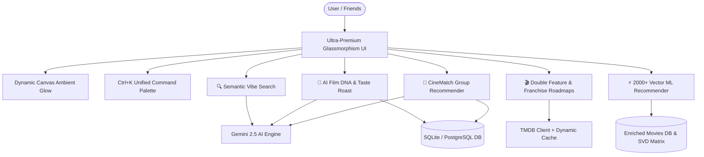

# 🚀 Movie Maverick: Next-Gen Platform Upgrade Implementation Plan

An architectural and feature blueprint to elevate **Movie Maverick** beyond standard recommendation engines (Letterboxd, IMDb, TasteDive), making it the most intelligent, interactive, and visually stunning movie discovery platform available.

---

## 🌟 Executive Overview & Vision

While traditional platforms rely either strictly on basic genre tags or passive community lists, **Movie Maverick Next-Gen** combines:
1. **Multi-User Consensus Intelligence (CineMatch)** — Solves the age-old problem of two or more people deciding what to watch.
2. **Deep Film DNA & AI Taste Roasting** — Uncovers users' psychological cinematic archetypes with viral, shareable critique cards.
3. **Semantic Vibe & Scene Search** — Natural language aesthetic and trope search powered by Google Gemini 2.5.
4. **Curated Thematic Double-Features & Franchise Roadmaps** — Paired cinematic journeys and interactive timeline trackers.
5. **Enriched 2,000+ Movie Vector ML Catalog** — Instant, high-dimensional TF-IDF & SVD recommendations spanning 100 years of cinema.
6. **Ultra-Premium Ambient UI/UX** — Dynamic poster color extraction, `Ctrl+K` power-user command palette, and interactive soundtrack vibes.

---

## 📐 Proposed Architectural Enhancements

---

## 🛠️ Proposed Feature Roadmap & Components

### 1. 🔮 AI CineMatch — Date Night & Group Consensus Recommender (`/cinematch`)
- **Friend / Partner Taste Fusion**: Select two registered users or enter two different taste profiles / seed movies.
- **Consensus Scoring Algorithm**: Intersects collaborative embeddings and content vectors to compute:
  - **Compatibility Score %** (e.g. *87% Match: High overlap on Dark Thrillers, divergence on Musicals*).
  - **Top Consensus Recommendations** with AI explanations of why *both* parties will enjoy each pick.
  - **The Great Compromise**: A film that bridges both tastes from an unexpected genre.
  - **Dealbreaker Filters**: Zero-tolerance genre/tag exclusion (e.g. "No Horror", "Under 100 minutes", "Available on Netflix").

### 2. 🧬 AI Film DNA & Taste Roaster (`/film-dna`)
- **6-Dimensional Cinephile Radar**:
  - *Pacing* (Slow Burn vs Adrenaline Rush)
  - *Tone* (Nihilistic / Gritty vs Whimsical / Uplifting)
  - *Complexity* (Mind-Bending vs Feel-Good Popcorn)
  - *Visual Aesthetic* (Minimalist Realism vs Grand Spectacle)
  - *Decade Affinity* (Golden Era, 90s Nostalgia, Contemporary)
  - *Director Archetype* (Nolan, Tarantino, Wes Anderson, Denis Villeneuve, Studio Ghibli)
- **Dual AI Persona Modes**:
  - 🎭 **"Roast My Taste"**: Witty, satirical critique analyzing guilty pleasures, rating biases, and film snobbery.
  - 🏆 **"Praise My Taste"**: Poetic, insightful tribute to the user's cinematic depth.
- **The Blindspot Antidote**: 3 curated films outside their usual genres designed to expand their taste.
- **Shareable Visual Card**: Canvas-rendered exportable PNG card formatted for social sharing (Instagram Stories, Twitter/X, Discord).

### 3. 🔍 Semantic Vibe & Aesthetic Search (`/vibe-search`)
- **Natural Language Vibe Queries**: Allows queries like:
  - *"Rainy neon-lit neo-noir with jazz soundtrack and existential dread"*
  - *"Bittersweet coming-of-age road trips where strangers become family"*
  - *" claustrophobic submarine or spaceship thrillers with high psychological tension"*
- **Curated Micro-Aesthetic Tags**: `Cyberpunk`, `Cottagecore`, `A24 Elevated Horror`, `90s Mall Nostalgia`, `Coffee Shop Melancholy`, `Mindfuck Plot Twists`.
- **Instant Semantic Filter Chips**: Integrated directly into `/explore` and `/discover`.

### 4. 🎬 Double Feature & Franchise Roadmaps (`/double-feature` & `/universes`)
- **Thematic Double-Feature Generator**:
  - Automatically pairs any selected movie with its perfect cinematic counterpart (e.g. *Whiplash + Black Swan: The Cost of Perfection*, *Her + Blade Runner 2049: The Soul of Artificial Intelligence*).
  - Generates an "Intermission Guide" (thematic connections, recommended refreshments, audio transition).
- **Interactive Franchise Universe Explorer**:
  - Covers top cinema universes: **Marvel Cinematic Universe (MCU)**, **Star Wars Universe**, **Christopher Nolan Multiverse**, **Denis Villeneuve Sci-Fi**, **A24 Modern Horror**, **Studio Ghibli Classics**, **Lord of the Rings & Middle Earth**, **Tarantino Connected Universe**.
  - Toggles: **Release Order** vs **In-Universe Chronological Order**.
  - Interactive watch status tracking, total franchise runtime calculator, and completion badge awards.

### 5. ⚡ 2,000+ Curated Movie Vector ML Catalog
- **Data Scaling**:
  - Expand local dataset from 30 movies to **2,000+ top all-time & critically acclaimed films** spanning 1920–2026.
  - Include rich metadata: `movieId`, `title`, `genre`, `year`, `avg_rating`, `vote_count`, `director`, `top_cast`, `keywords`, `overview`, `runtime`, `imdb_score`.
- **High-Speed Vector Engine**:
  - Optimized pure NumPy sparse TF-IDF and SVD matrices with zero external binary bottlenecks and sub-100ms startup times.
  - Graceful TMDB live hydration for long-tail search queries.

### 6. 🎨 Ultra-Premium Dynamic Ambient UI & Command Palette
- **Dynamic Poster Ambient Glow**:
  - Extracts dominant colors from active movie posters to cast a subtle, animated ambient glow behind detail cards and trailer backdrops.
- **Unified Command Palette (`Ctrl+K` / `Cmd+K`)**:
  - Global spotlight modal with keyboard navigation: search movies, jump to actors, toggle dark/light theme, roll roulette, launch CineMatch, or view watchlist.
- **Interactive Soundtracks & Audio Vibes**:
  - Direct Spotify and Apple Music soundtrack search links embedded into movie detail pages.
- **Live User Taste Compatibility Badge**:
  - Displays dynamic match percentage (*"You & @alex have an 89% Taste Match"*) on user profile pages.

---

## 📂 Proposed File Changes

### Backend & Machine Learning
- **[MODIFY] [model/recommenders.py](file:///c:/Users/Acer/Desktop/Dekstop/Projects/Movies_recc/Movies_recomendation/model/recommenders.py)**: Scale TF-IDF & SVD models for 2,000+ movies, add CineMatch consensus fusion algorithm and Double Feature matching.
- **[MODIFY] [model/ai_recommender.py](file:///c:/Users/Acer/Desktop/Dekstop/Projects/Movies_recc/Movies_recomendation/model/ai_recommender.py)**: Add `get_cinematch_recommendation()`, `get_taste_roast_or_praise()`, `get_semantic_vibe_search()`, and `get_double_feature_pairing()`.
- **[MODIFY] [data/movies_enriched.csv](file:///c:/Users/Acer/Desktop/Dekstop/Projects/Movies_recc/Movies_recomendation/data/movies_enriched.csv)**: Expand dataset to 2,000+ enriched global cinema titles.
- **[MODIFY] [app.py](file:///c:/Users/Acer/Desktop/Dekstop/Projects/Movies_recc/Movies_recomendation/app.py)**: Add routes for `/cinematch`, `/film-dna`, `/vibe-search`, `/double-feature`, `/universes`, and corresponding JSON APIs.
- **[MODIFY] [model/models.py](file:///c:/Users/Acer/Desktop/Dekstop/Projects/Movies_recc/Movies_recomendation/model/models.py)**: Add `FranchiseProgress` and `SharedSession` models for tracking franchise watch-progress and CineMatch room invites.

### Templates & User Interface
- **[NEW] [templates/cinematch.html](file:///c:/Users/Acer/Desktop/Dekstop/Projects/Movies_recc/Movies_recomendation/templates/cinematch.html)**: Interactive Date Night & Group Consensus Recommender UI.
- **[NEW] [templates/film_dna.html](file:///c:/Users/Acer/Desktop/Dekstop/Projects/Movies_recc/Movies_recomendation/templates/film_dna.html)**: 6D Cinephile Radar, Roast/Praise interactive mode, and exportable card.
- **[NEW] [templates/vibe_search.html](file:///c:/Users/Acer/Desktop/Dekstop/Projects/Movies_recc/Movies_recomendation/templates/vibe_search.html)**: Semantic aesthetic search with dynamic micro-tags.
- **[NEW] [templates/double_feature.html](file:///c:/Users/Acer/Desktop/Dekstop/Projects/Movies_recc/Movies_recomendation/templates/double_feature.html)**: Thematic double feature curator with intermission guides.
- **[NEW] [templates/universes.html](file:///c:/Users/Acer/Desktop/Dekstop/Projects/Movies_recc/Movies_recomendation/templates/universes.html)**: Interactive franchise timeline explorer with runtime calculators.
- **[MODIFY] [templates/base.html](file:///c:/Users/Acer/Desktop/Dekstop/Projects/Movies_recc/Movies_recomendation/templates/base.html)**: Add `Ctrl+K` command palette, updated navigation links, and dynamic ambient lighting scripts.
- **[MODIFY] [templates/movie_details.html](file:///c:/Users/Acer/Desktop/Dekstop/Projects/Movies_recc/Movies_recomendation/templates/movie_details.html)**: Add ambient glow backdrop, soundtrack streaming links, and "Pair as Double Feature" button.
- **[MODIFY] [templates/profile.html](file:///c:/Users/Acer/Desktop/Dekstop/Projects/Movies_recc/Movies_recomendation/templates/profile.html)**: Add Film DNA preview and Taste Match compatibility score badge.
- **[MODIFY] [static/style.css](file:///c:/Users/Acer/Desktop/Dekstop/Projects/Movies_recc/Movies_recomendation/static/style.css)** & **[static/premium.css](file:///c:/Users/Acer/Desktop/Dekstop/Projects/Movies_recc/Movies_recomendation/static/premium.css)**: Modern neo-brutalist / glassmorphism tokens, canvas glow effects, and interactive charts.

---

## 🧪 Verification Plan

### Automated Testing
- `pytest`: Run complete regression test suite across all new routes and endpoints.
- `test_cinematch.py`: Validate 2-user consensus scoring and boundary conditions (identical tastes vs completely opposite tastes).
- `test_film_dna.py`: Validate 6D personality vectors and JSON parsing for taste roast/praise.
- `test_semantic_search.py`: Verify Gemini semantic queries and fallback parsing.
- `test_large_catalog.py`: Verify dataset loading, TF-IDF vectorization, and SVD inference speed (< 150ms).

### Manual Verification
- Test `/cinematch` with various friend taste combinations.
- Test `/film-dna` with rich viewing histories, verify card export and roast mode.
- Test `Ctrl+K` command palette across all pages.
- Verify responsive layout on mobile, tablet, and widescreen displays.
